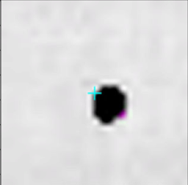
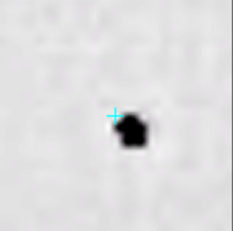
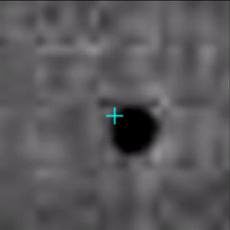

# SDLC_XMALab Config File Reference
## Project Settings
**task**: The animal/behavior you’re trying to study. Pulled from the name given to your project folder  
**experimenter**: Your initials  
**working_dir**: The full directory path to your project folder  
**path_config_file**: The full directory path to the DeepLabCut config for your project  
**dataset_name**: An arbitary name for your dataset. Used when generating training data for DeepLabCut, which can be found in the `labeled-data` folder inside of your DLC project folder. 

## Neural Network Customization
**nframes**: The number of frames of video that you tracked before giving the network to DeepLabCut. Automatically determined from CSVs if set to 0  
**max_iters**: The maximum number of iterations to train the network for before automatically stopping training. Default is 150,000  
**tracking_threshold**: Fraction of the total video frames to include in the training sample. Used to warn if the network detects too many/too few frames when extracting frames to be passed to the network  
**tracking_mode**: Determines the mode that sdlc_xmalab will attempt to train your network with:  

- **2D** - cam1 and cam2 will both be passed to the network from their respective video files  
- **per_cam** - cam1 and cam2 have their own networks
- **rgb** - cam1 and cam2 will be merged into an RGB video, with cam1 as the red channel, cam2 as the green channel, and a blank frame as the blue channel  

**swapped_markers**: Set to ‘true’ to create artificial markers with swapped y coordinates (y coordinates of swapped-cam1 will be cam2’s y coordinates). Only valid for the rgb tracking_mode  
**crossed_markers**: Set to ‘true’ to create artificial markers that are the result of multiplying the x/y positions of cam1 and cam2 together (cx_cam1_cam2_x = cam1_x * cam2_x). Only valid for the rgb tracking_mode.  

## Image Processing
**search_area**: The area, in pixels, around which autocorrect() will search for a marker. The minimum is 10, the default is 15.  
**threshold**: Grayscale value for image thresholding. Pixels with a value above this number are turned black, while pixels with a value below this number are turned white. The default is 8 (grayscale values range from 0=black to 255=white).  
**krad**: The size of the kernel used for Gaussian filtering of the image. The larger the kernel, the higher the filtered radius of a marker. The default is 17 (left) vs. a krad of 3 (right).  

    
    

**gsigma**: Responsible for small differences in image contrast. Can be modified as a last resort, but for the most part I would leave this alone. The default is 10.  
**img_wt**: Relative weight of the image when it is blended together with a blur. Typically you’ll want this to be significantly higher than the blur, and the default will work well for most X-ray images. The default is 3.6.  
**blur_wt**: Relative weight of the blur when it is blended together with an image. Typically you’ll want this to be significantly lower than the image, and the default will work well for most X-ray images. The default is -2.9.  
**gamma**: The level of contrast in the image. Higher gamma = lower contrast. The default is 0.1 (left) vs. gamma = 0.9 (right). Try to run with a level of gamma that avoids filtering out marker data, while not taking away valuable information from the image processing itself.

    
    

## Autocorrect() Function Visualization
**trial_name**: The trial to use for testing  
**cam**: The camera view to use for testing  
**frame_num**: The frame to use for testing    
**marker**: The marker to use for testing  
**test_autocorrect**: Set to ‘true’ if you want to see/troubleshoot all of the post-processing steps that autocorrect goes through for a certain trial/cam/marker/frame combination  

- Requires a way to visualize image output like Jupyter Notebook
- You can also use the provided jupyter_test_autocorrect.ipynb file from the repo
