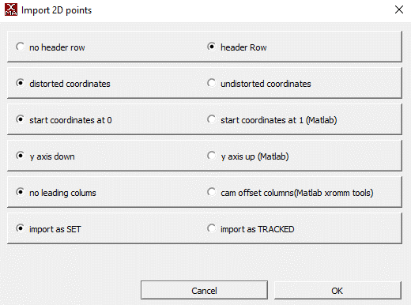

# Usage Guide
There are two ways to use this package. You can either:

1. Follow the usage guide below to run everything locally.

## Getting started and creating a new project
1. If you haven't already, follow the steps in the [installation guide](install.md) to install this package!
1. Activate your conda environment
    ```bash
    conda activate your-env-name
    ```
1. Open an interactive Python session
    ```bash
    ipython
    ```
1. From the terminal, run the following commands (replacing `/path/to/project-folder` with the path to the folder for your project and `SD` with your initials):
    ```python
    from deepxromm import DeepXROMM 
    working_dir = '/path/to/project-folder'
    experimenter = 'SD'
    
    # Basic usage
    deepxromm = DeepXROMM.create_new_project(working_dir, experimenter)
    
    # With custom tracking mode
    deepxromm = DeepXROMM.create_new_project(working_dir, experimenter, mode='per_cam')
    
    # With custom video codec
    deepxromm = DeepXROMM.create_new_project(working_dir, experimenter, codec='XVID')
    
    # With both custom mode and codec
    deepxromm = DeepXROMM.create_new_project(working_dir, experimenter, mode='rgb', codec='DIVX')
    ```
    
    **Available tracking modes:**
    - `2D` (default): Combines camera data into a single DeepLabCut project
    - `per_cam`: Creates separate DeepLabCut projects for each camera view  
    - `rgb`: Blends grayscale videos into RGB channels for single-network training

    **Video codec options:** 
    - `avc1` (default): H.264 codec, good balance of quality and compatibility
    - `XVID`, `DIVX`: Alternative compression codecs
    - `mp4v`, `MJPG`: Other supported formats
    - `uncompressed`: No compression (large file sizes)

    > **Note:** Not all codecs are available on all systems. DeepXROMM will raise a `RuntimeError` if the specified codec is unavailable.

    1. Keep your Python session open. We'll be running more commands here shortly
1. You should now see something that looks like this inside of your project folder:
    ```bash
    sample-proj
    │   project_config.yaml
    │
    ├───sample-proj-SD-YYYY-MM-DD
    ├───trainingdata
    ├───trials
    ```

## Exporting your data from XMAlab in a usable format
1. For now, DeepXROMM only supports analyzing **full distorted videos (.avi)**. However, we understand that many labs use distorted .tif or .jpg stacks and plan to add support for these in a later release
1. Along with your distorted videos, DeepXROMM expects CSV training data (XMAlab 2D points) exported with the following settings
{: .center}

## Importing your data and loading the project
1. The simplest approach is to create a new folder inside of the trainingdata folder named after your trial and place your raw videos, as well as distorted 2D points from tracking, in the folder.
1. There are also a number of options for customization in the project_config.yaml file. Check out the [config file reference](config.md) to learn more about what each variable does
1. After you have added the trainingdata and/or trial folders, make sure to load the project. You should also reload it every time you update any settings.
    ```python
    deepxromm = DeepXROMM.load_project(working_dir)
    ```

## Converting XMAlab data to DeepLabCut format

XMAlab and DeepLabCut both use CSV files (or a more data-rich format called HDF) as their primary means of storing tracking data.
In order to train a network for XMAlab trials, we need to convert the XMAlab-formatted data exported in the previous step
to a format that DeepLabCut can use. To do this, you can run:

```python
deepxromm.xma_to_dlc()
```

## Creating a training dataset

Next, we'll use the DLC formatted data we just extracted and codify it as our training
data for this run of our model. To do this, you can run:

```python
deepxromm.create_training_dataset()
```

## Training the project
1. To start training your network, run the following in your Python terminal
    ```python
    deepxromm.train_network()
    ```

> **Batch processing:** To train multiple projects automatically, see [Batch Training Multiple Projects](#batch-training-multiple-projects).

## Using a trained network to track your trial(s)
1. Make sure any trials that you want to analyze are in appropriately named folders in the `trials` directory, and each folder contains a CSV and distorted cam1/cam2 videos that are named **folder_name**.csv, **folder_name**_cam1.avi, and **folder_name**_cam2.avi, respectively
1. Run the following commands in your Python terminal:
    ```python
    from deepxromm import DeepXROMM
    working_dir = '/path/to/project-folder'
    deepxromm = DeepXROMM.load_project(working_dir)
    deepxromm.analyze_videos()
    ```
1. This will save a file named **trial_name**-Predicted2DPoints.csv to the it# file (where number is the number next to iteration: in your project_folder/project-name-SD-YYYY-MM-DD/config.yaml file) inside of your trials/trial_name folder
1. You can analyze the network's performance by importing this CSV as a 2D Points file into XMAlab with the following settings

{: .center}

> **Quality assessment:** After analysis, use the methods in [Advanced Analysis Methods](#advanced-analysis-methods) to validate your results.

## Batch Training Multiple Projects

For labs with multiple DeepXROMM projects, you can automate the entire training pipeline using the `train_many_projects()` static method.

**Complete workflow performed:**
1. Load each project configuration
2. Convert XMAlab data to DeepLabCut format (`xma_to_dlc()`)
3. Create training datasets (`create_training_dataset()`)
4. Train neural networks (`train_network()`)
5. Analyze videos with trained models (`analyze_videos()`)
6. Convert predictions back to XMAlab format (`dlc_to_xma()`)

**Usage:**
```python
from deepxromm import DeepXROMM

# Point to parent directory containing project folders
parent_directory = '/path/to/parent/containing/projects'
DeepXROMM.train_many_projects(parent_directory)
```

**Prerequisites:**
- Each subdirectory should be a complete DeepXROMM project
- Each project must have `project_config.yaml` 
- Training data must be in `trainingdata/` folders
- Trial videos must be in `trials/` folders

> **Important:** This is a **static method** - call it directly on the `DeepXROMM` class, not on an instance.

**Cross-reference:** See individual workflow steps in sections above for details on each operation performed.

## Using autocorrect()
This package comes pre-built with autocorrect() functions that leverage the same image filtering functions as XMAlab, and use the marker's outline to do centroid detection on each marker. You can modify the autocorrect function's performance using the **image processing** parameters from the [config file reference](config.md). You can also visualize the centroid detection process using the **test_autocorrect()** parameters.
### Testing autocorrect() parameters on a single marker/frame combination
You'll need a Python environment that is capable of displaying images, like a [Jupyter Notebook](https://jupyter.org/), for these steps  

1. Go to your project_config.yaml file and find the "Autocorrect() Testing Vars" section of the config  
1. Change the value of **test_autocorrect** to true by replacing the word "false" with the word "true", like this:  
    ```YAML
    test_autocorrect: true
    ```
1. Specify a trial (trial_name), camera (cam), frame number (frame_num), and marker name (marker) to test the autocorrect function on  
1. Import the package and initialize a deepxromm instance as above and run the following code snippet
    ```python
    deepxromm.autocorrect_trials()
    ```
1. Tune autocorrect() settings until you are satisfied with the testing output
### Using autocorrect for a whole trial
1. If you tested autocorrect, set the test_autocorrect variable in your config file to false
    ```YAML
    test_autocorrect: false
    ```
1. Import the package and initialize a deepxromm instance as a above and run the following code snippet
    ```python
    deepxromm.autocorrect_trials()
    ```
1. This will save a file named **trial_name**-AutoCorrected2DPoints.csv to the it# file (where number is the number next to iteration: in your project_folder/project-name-SD-YYYY-MM-DD/config.yaml file) inside of your trials/trial_name folder
    ```YAML
    iteration: 0
    ```
1. You can analyze autocorrect's performance by importing this CSV as a 2D Points file into XMAlab with the following settings

{: .center}

## Choosing regions with high variation

One thing that has been previously shown to help with neural network performance is variation of movement.
To assist with finding regions of maximal dissimilarity within trial videos, we developed an automated function finds
the portion of your videos with the most movement.
To change how large the region we find is, simply change the size of the sliding window to suit your tracking needs.

To use this function:

1. Boot up your conda environment
1. Import the package
1. Load your project
1. Run the following function
    1. Replace **/path/to/your/trial** with the folder where your raw videos are stored
    1. Replace **size_of_window** with how many frames you want to track
```python
deepxromm.get_max_dissimilarity_for_trial('/path/to/your/trial', size_of_window)
```

> **Related:** For other analysis tools to evaluate your data, see [Advanced Analysis Methods](#advanced-analysis-methods).

## Advanced Analysis Methods

DeepXROMM provides several analysis tools to help you explore and validate your XMA project data, compare trials, and assess tracking quality.

### Video Similarity Analysis

#### Project-Level Video Comparison
Analyze video similarity across all trials in your project using perceptual image hashing:

```python
similarity_scores = deepxromm.analyze_video_similarity_project()
print(similarity_scores)  # Dictionary with similarity metrics
```

**Returns:** Dictionary with similarity scores (0 = identical videos, higher values = more different)

**Use cases:**
- Verify consistent camera positioning across trials
- Identify outlier trials with different lighting or setup
- Validate stereo camera alignment

> **⚠️ Warning:** This method assumes all cam1/cam2 pairs in your project have the same relationship (either all similar or all different). Mixed similarity patterns may produce unreliable results.

#### Trial-Level Video Comparison
Compare similarity between camera views for a specific trial:

```python
similarity_score = deepxromm.analyze_video_similarity_trial()
print(f"Cam1/Cam2 similarity: {similarity_score}")
```

**Returns:** Float representing dissimilarity between the trial's camera pairs

**Use case:** Validate that your stereo camera setup captures appropriately different perspectives of the same scene.

### Marker Trajectory Analysis

#### Project-Level Marker Comparison
Analyze marker movement patterns across all trials:

```python
marker_similarity = deepxromm.analyze_marker_similarity_project()
print(marker_similarity)  # Dictionary with marker trajectory metrics
```

**Returns:** Dictionary with trajectory similarity scores for each marker

**Use cases:**
- Identify consistent vs. variable movement patterns
- Detect trials with unusual marker behavior
- Validate tracking consistency across experimental conditions

> **⚠️ Warning:** Like video analysis, this assumes consistent cam1/cam2 relationships across all trials.

#### Trial-Level Marker Comparison
Compare marker positions between camera views for a specific trial:

```python
marker_differences = deepxromm.analyze_marker_similarity_trial()
print(f"Mean position differences: {marker_differences}")
```

**Returns:** Mean coordinate differences between paired markers (cam1_X - cam2_X, cam1_Y - cam2_Y)

**Use cases:**
- Validate marker tracking accuracy between camera views
- Identify problematic markers or time periods
- Assess stereo calibration quality

### Utility Methods

#### Extract Marker Names from XMAlab Data
Programmatically retrieve bodypart/marker names from XMAlab CSV files:

```python
marker_names = deepxromm.get_bodyparts_from_xma(
    csv_path='/path/to/trial/data.csv',
    mode='2D'  # Match your project's mode
)
print(f"Found markers: {marker_names}")
```

**Parameters:**
- `csv_path` (str): Path to XMAlab 2D points CSV file
- `mode` (str): Must match your project mode (`'2D'`, `'per_cam'`, or `'rgb'`)

**Returns:** List of marker names found in the CSV file

**Use cases:**
- Validate marker naming consistency across trials before training
- Programmatically verify expected markers are present
- Debug import/export issues

**Cross-reference:** Use with the data import workflow described in [Importing your data and loading the project](#importing-your-data-and-loading-the-project).
